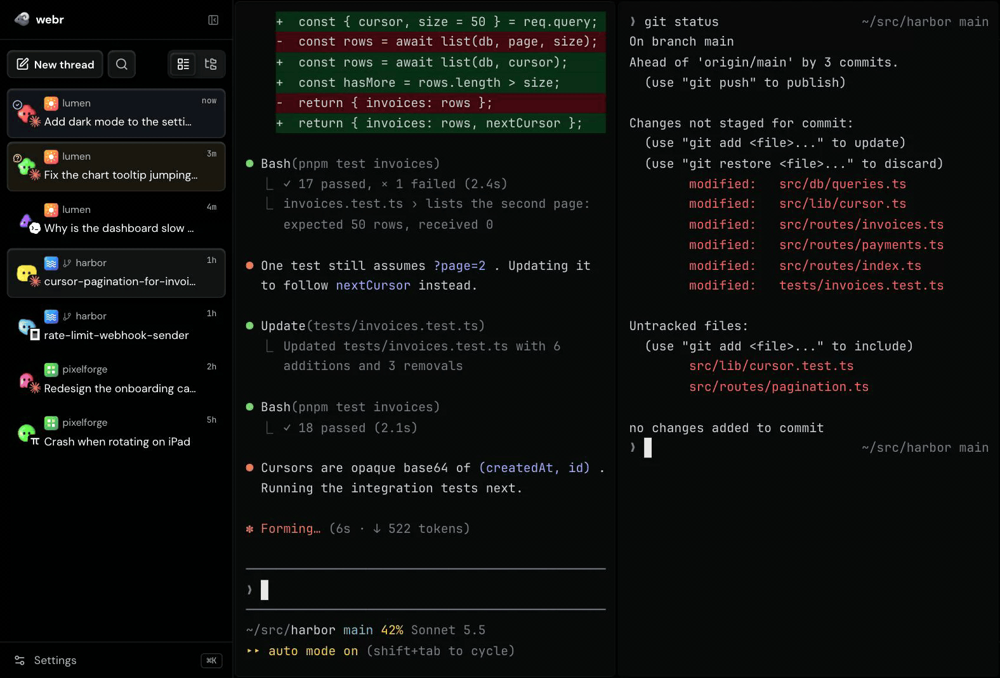
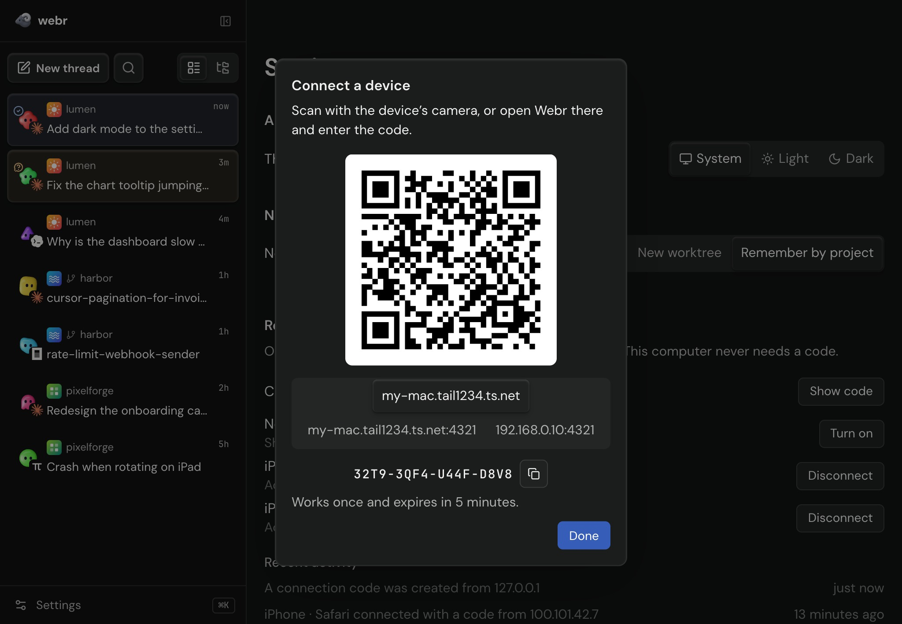
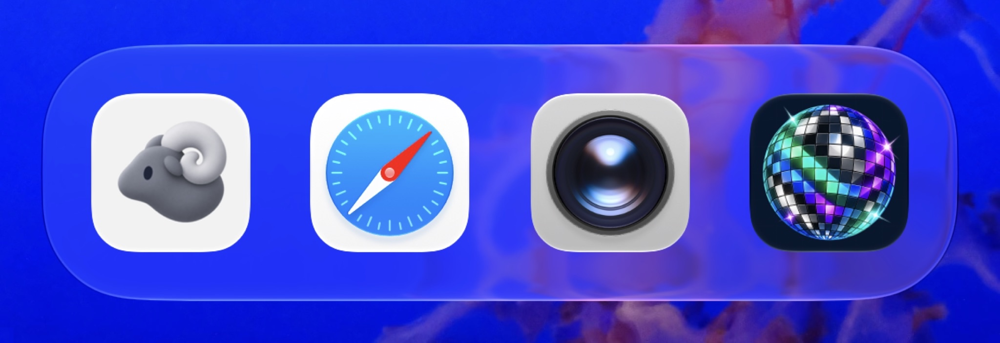
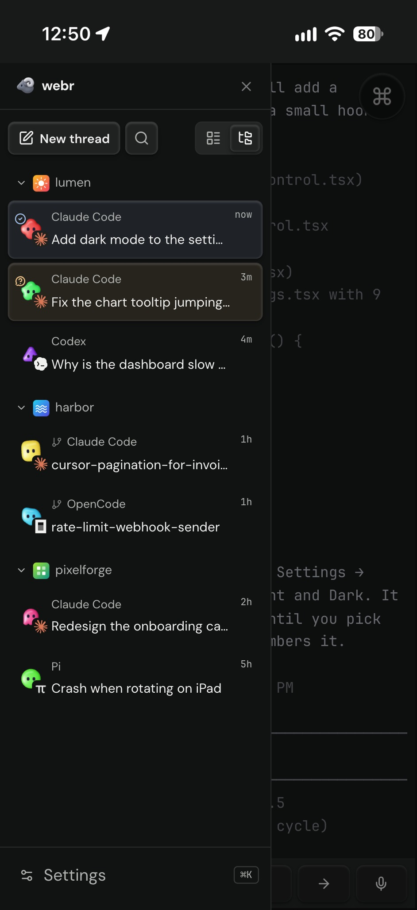
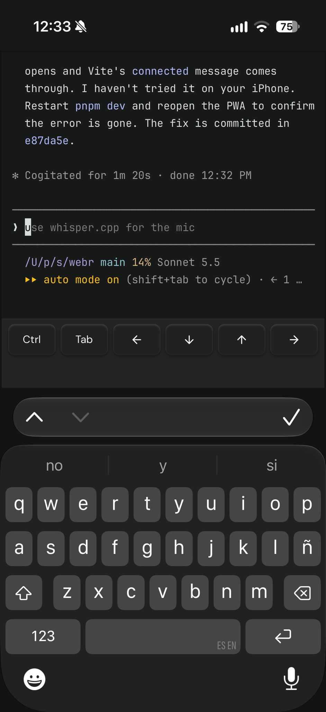
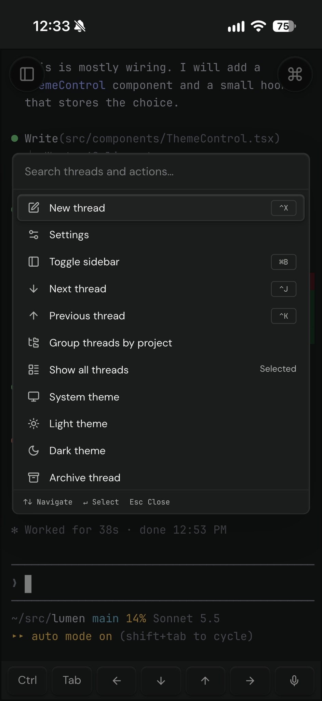

<p align="center">
  
</p>
<p align="center">
  <i align="center">Control your Herdr agents from anywhere.</i>
</p>

<h1 align="center">webr</h1>

> [!IMPORTANT]
> This repo is a WIP. Expect bugs and breaking changes



## Features

- 📱 **Pair by QR code**: scan a one-time code, approve the device from your computer, and revoke it any time.
- 🔒 **Private HTTPS over Tailscale**: Webr picks up your tailnet address automatically, so it works away from home and unlocks the microphone.
- ⌨️ **Real terminal, touch-friendly**: flick to scroll, plus a key bar with Ctrl, Tab and arrows that keeps the keyboard open.
- 🎙️ **Dictate from your phone**: tap the mic and your speech is transcribed on your own computer with Parakeet v3, in 25 languages. The model loads only while you use it.
- 👀 **Agents at a glance**: threads grouped by project, with live status and a notification when an agent needs you.
- 🖼️ **Attach images**: paste or drop screenshots into a prompt.
- 🚀 **Jump anywhere**: a command palette for threads and actions, and projects and worktrees on remote machines.

## Mobile

Zero config, PWA, with Tailscale automation out of the box.

<table>
  <tr>
    <td colspan="3"></td>
  </tr>
  <tr>
    <td colspan="3"></td>
  </tr>
  <tr>
    <td></td>
    <td></td>
    <td></td>
  </tr>
</table>

## Install

From the Herdr plugin index:

```sh
herdr plugin install pablopunk/webr/plugin
```

Or with the npm package, which also handles updates:

```sh
npm i -g @pablopunk/webr
webr plugin install
```

## LICENSE

AGPL-3.0-or-later
